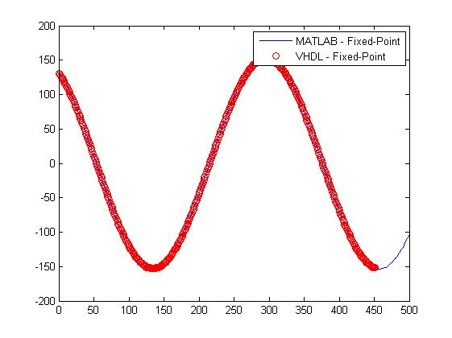

The GitHub repository encapsulates a comprehensive implementation of AM modulation, a fundamental technique in telecommunications. Initially, the AM module is meticulously modelled within the Simulink environment of MATLAB. This initial phase serves as the bedrock for subsequent developments. Upon successful modeling in Simulink, a pivotal transition occurs as the floating-point unit undergoes conversion to a fixed-point unit. This crucial step paves the way for the design of requisite blocks within a VHDL file.
By embracing this methodology, the repository enables the seamless translation of telecommunication systems onto digital platforms, particularly FPGAs. Post-implementation, a rigorous comparison ensues between the simulated floating-point MATLAB model and the fixed-point FPGA output. The meticulous analysis reveals compelling insights into the efficacy and precision of the implemented models. Remarkably, despite the utilization of significantly lower resources on the FPGA, the fixed-point model demonstrates a commendable parity in accuracy with its floating-point counterpart.
Visual representations provided within the repository elucidate this convergence of accuracy and resource efficiency. The figure shows how the fixed-point model, meticulously engineered for FPGA deployment, embodies a striking resemblance to its floating-point counterpart.

